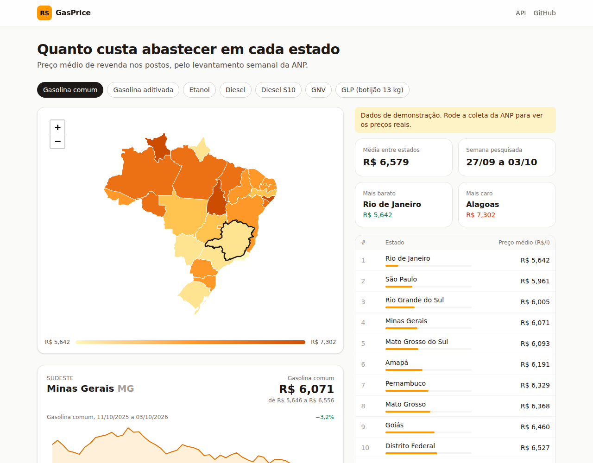
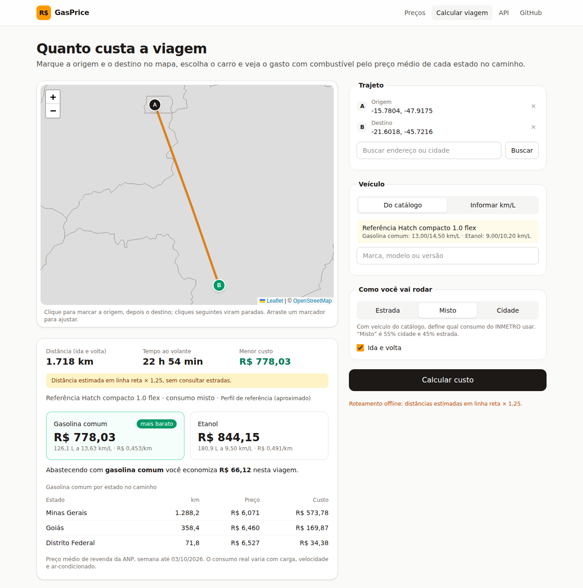

# GasPrice

Preço médio de revenda dos combustíveis em cada estado do Brasil: um mapa interativo, o ranking dos
estados, o histórico semanal, uma calculadora de custo de viagem e uma API JSON. Os dados vêm do
[Levantamento de Preços de Combustíveis da ANP](https://www.gov.br/anp/pt-br/assuntos/precos-e-defesa-da-concorrencia/precos),
publicado toda semana.



- **Site**: Django + Tailwind CSS v4 + [htmx](https://htmx.org). Trocar o combustível ou clicar num
  estado troca só o pedaço da página que mudou. O mapa é [Leaflet](https://leafletjs.com) com a malha
  dos estados; o gráfico de histórico é um SVG desenhado no servidor.
- **API**: [django-ninja](https://django-ninja.dev), documentação OpenAPI em `/api/v1/docs`.
- **Coleta**: `python manage.py collect_prices`, idempotente, com registro de cada execução.
- **Viagem** (`/trip/`): marque origem, destino e paradas no mapa, escolha o carro (catálogo do
  INMETRO) ou informe o km/L, e veja distância, tempo, litros e custo. O custo é rateado pelos km
  rodados em cada estado, cada trecho ao preço da ANP daquele estado; carro flex compara gasolina e
  etanol.



## Rodando localmente

Requer [uv](https://docs.astral.sh/uv/). Não precisa de Node: o Tailwind roda pelo binário standalone,
baixado na primeira execução.

```sh
uv sync
uv run poe css                                         # gera o CSS do Tailwind
DJANGO_DEBUG=1 uv run python manage.py migrate
DJANGO_DEBUG=1 uv run python manage.py collect_prices  # levantamento mais recente da ANP
uv run poe dev                                         # http://127.0.0.1:8000, recompila o CSS ao salvar
```

Sem acesso à ANP, `collect_prices --source demo` grava um ano de preços sintéticos para todos os
estados. Eles aparecem marcados como demonstração e perdem para qualquer dado real assim que a primeira
coleta da ANP acontecer.

### Catálogo de veículos

```sh
DJANGO_DEBUG=1 uv run python manage.py import_vehicles --file tabela-pbev-2025.xlsx --year 2025
DJANGO_DEBUG=1 uv run python manage.py import_vehicles --reference   # perfis genéricos, sem modelos reais
```

A tabela do [Programa Brasileiro de Etiquetagem Veicular](https://www.gov.br/inmetro/pt-br/assuntos/avaliacao-da-conformidade/programa-brasileiro-de-etiquetagem/tabelas-de-eficiencia-energetica/veiculos-automotivos-pbe-veicular)
traz km/L de cidade e estrada para etanol e para gasolina ou diesel. O leitor procura o cabeçalho
(inclusive o de várias linhas, com células mescladas) em vez de assumir posições; uma planilha feita
à mão com as colunas `MARCA, MODELO, VERSÃO, ANO, GASOLINA CIDADE, GASOLINA ESTRADA, ETANOL CIDADE,
ETANOL ESTRADA` também serve. Importar de novo substitui o catálogo daquela fonte. Sem catálogo, a
página abre direto em "Informar km/L".

### Roteamento e mapa

| Variável | Padrão | Para quê |
| --- | --- | --- |
| `GASPRICE_ROUTER` | `osrm` | `osrm` consulta rotas por estrada; `straight` estima sem rede (linha reta × 1,25), marcado na tela. |
| `GASPRICE_OSRM_URL` | servidor público de demonstração do OSRM | Aponte para um OSRM próprio em produção. |
| `GASPRICE_NOMINATIM_URL` | Nominatim público | Busca de endereços; o público pede no máximo 1 requisição/s (respeitado) e proíbe autocomplete, por isso a busca é no Enter. |
| `GASPRICE_TILE_URL` | tiles do OpenStreetMap | Fundo do mapa da viagem. Para um site com tráfego, use um provedor (MapTiler, Carto, Stadia) e `GASPRICE_TILE_ATTRIBUTION`. |

O servidor público do OSRM é para testes, sem garantia. Para uso real, um OSRM próprio com o mapa do
Brasil (o código não muda, só a URL):

```sh
mkdir osrm && cd osrm
curl -LO https://download.geofabrik.de/south-america/brazil-latest.osm.pbf
docker run --rm -v "$PWD:/data" osrm/osrm-backend osrm-extract -p /opt/car.lua /data/brazil-latest.osm.pbf
docker run --rm -v "$PWD:/data" osrm/osrm-backend osrm-partition /data/brazil-latest.osrm
docker run --rm -v "$PWD:/data" osrm/osrm-backend osrm-customize /data/brazil-latest.osrm
docker run -d -p 5000:5000 -v "$PWD:/data" osrm/osrm-backend osrm-routed --algorithm mld /data/brazil-latest.osrm
# GASPRICE_OSRM_URL=http://localhost:5000
```

A extração do Brasil precisa de alguns GB de memória; depois disso o servidor responde rápido com pouco.

### Coleta

| Comando | O que faz |
| --- | --- |
| `collect_prices` | Descobre a planilha semanal mais recente na página da ANP e grava os preços por estado. |
| `collect_prices --workbook URL_OU_ARQUIVO` | Lê uma planilha específica. Serve para carregar a série histórica (`semanal-estados-desde-2013.xlsx`) ou para quando a página da ANP mudar. |
| `collect_prices --source petrobras` | Preço da gasolina da página de composição de preços da Petrobras (fonte secundária). |
| `collect_prices --source demo` | Dados sintéticos para desenvolvimento. |

Regravar o mesmo período atualiza em vez de duplicar, então a coleta pode rodar quantas vezes for
preciso. Uma coleta que não reconhece nenhum preço conta como falha (geralmente significa que o layout
da planilha mudou). Toda execução, com sucesso ou não, fica registrada, e `/api/v1/health` responde
503 quando a última coleta real bem-sucedida tem mais de `GASPRICE_MAX_AGE_DAYS` dias.

Em produção, agende a coleta. Com o `compose.yml` isso já vem pronto (serviço `collector`). Com cron:

```cron
0 */12 * * * cd /app && python manage.py collect_prices
```

## API

| Rota | Descrição |
| --- | --- |
| `GET /api/v1/prices?fuel=&state=` | Preço atual por estado e combustível, filtrável pelos dois. |
| `GET /api/v1/boards/{fuel}` | Todos os estados para um combustível, do mais barato ao mais caro, com a média. |
| `GET /api/v1/prices/{uf}/{fuel}/history?since=` | Série semanal de um estado e combustível. |
| `GET /api/v1/states`, `GET /api/v1/fuels` | Catálogos. |
| `GET /api/v1/health` | Situação da coleta; 503 quando os dados estão velhos. |
| `POST /api/v1/trips/estimate` | Custo de uma viagem: `points` (2 a 10 `{lat, lon}`), `vehicle_id` ou `manual` (`{"gasoline": 12.5}`), `profile` (`highway`, `mixed`, `city`), `round_trip`. |
| `GET /api/v1/vehicles?q=` | Busca no catálogo de veículos. |
| `GET /api/v1/places?q=` | Busca de endereços no Brasil. |

Combustíveis: `gasoline`, `gasoline_premium`, `ethanol`, `diesel`, `diesel_s10`, `cng` (GNV), `lpg` (GLP).
Preços são strings decimais com três casas (`"6.199"`), como a ANP publica.

## Deploy

```sh
cp .env.example .env    # DJANGO_DEBUG=0, DJANGO_SECRET_KEY, DJANGO_ALLOWED_HOSTS
docker compose up -d --build
```

A imagem roda as migrações ao subir e serve os estáticos pelo WhiteNoise. Sem `DATABASE_URL`, usa SQLite
num volume; com ele, qualquer banco que o Django suporte (Postgres recomendado se houver mais de um
processo escrevendo).

## Desenvolvimento

```sh
uv run poe fix     # formata, corrige lint, checa tipos, migrações pendentes e testes
uv run poe check   # o mesmo sem reescrever arquivos: é o que o CI roda
```

O código segue arquitetura hexagonal (`domain` → `application` → `adapters`), e um teste garante que o
núcleo não importa Django nem bibliotecas de I/O. As decisões e seus porquês estão em
[docs/decisions.md](docs/decisions.md).

```
src/gasprice/
├── config/                 settings, urls, wsgi
├── prices/
│   ├── domain/             estados, combustíveis, relatório de preço, ranking (só pydantic)
│   ├── application/        portas e casos de uso: coletar, ranking, histórico, saúde
│   └── adapters/           ANP, Petrobras, ORM, API ninja, views htmx, comando de coleta
├── trips/
│   ├── domain/             coordenadas, rateio por estado, consumo, estimativa de custo
│   ├── application/        portas (rotas, endereços, preços, catálogo) e planejar viagem
│   └── adapters/           OSRM, Nominatim, estado por ponto, leitor PBEV, views e API
├── shared/                 cliente HTTP com retry
└── web/                    templates, Tailwind, mapas, assets vendorizados
```

## Créditos

- Dados: Agência Nacional do Petróleo, Gás Natural e Biocombustíveis (ANP); consumo de veículos: INMETRO/PBEV.
- Rotas: [OSRM](https://project-osrm.org); endereços: [Nominatim](https://nominatim.org); mapa: © colaboradores do [OpenStreetMap](https://www.openstreetmap.org/copyright).
- Malha dos estados: [click_that_hood](https://github.com/codeforgermany/click_that_hood), simplificada com mapshaper.
- [Leaflet](https://leafletjs.com) e [htmx](https://htmx.org), vendorizados em `src/gasprice/web/static/vendor` com suas licenças.
